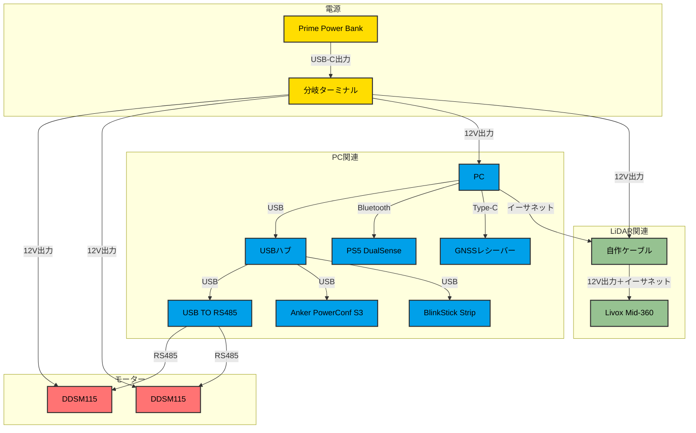

# susumu_robo

## プロジェクト概要
ROS2搭載でパワフルながら静かに動く小型移動ロボット。
永遠に完成しない適当プロジェクト？
現在は地図作成に注力中。

## 主要機能

### 現在アクティブな機能
- [x] タッチ対応GUI メニュー
- [x] 3D LiDAR（Livox Mid-360）
- [x] 音声合成（VoiceVox）
- [x] GLIM
- [x] GNSS

### 一度開発したもののほったらかし
- [x] PS5 DualSenseゲームパッド制御
- [x] SLAM & ナビゲーション（slam_toolbox, Nav2）
- [x] 音声認識（ASR）
- [x] 音声アクティビティ検出（Silero VAD）
- [x] 衝突回避システム
- [x] デプスカメラ（RealSense D435i）
- [x] LED制御（BlinkStick Strip）
- [x] Foxgloveによる可視化
- [x] アバター

### 問題あり
- [x] ウェイクワード検出（Alexa, Hey Jarvis, Hey Mycroft）

## ハードウェア
### 機器
| Item                                                                                                                                                                                                                                                   | 数量 | 重量                                                   | 補足・備考                                                                             |
|--------------------------------------------------------------------------------------------------------------------------------------------------------------------------------------------------------------------------------------------------------|----|------------------------------------------------------|-----------------------------------------------------------------------------------|
| [Prime Power Bank (27650mAh, 250W)](https://www.ankerjapan.com/products/a1340) | 1 | [約665g](https://www.ankerjapan.com/products/a1340) | USB-C1 / C2 出力：5V⎓3A / 9V⎓3A / 12V⎓1.5A / 15V⎓3A / 20V⎓5A / 28V⎓5A (最大140W) |
| [DDSM115 ダイレクトドライブサーボモーター](https://www.switch-science.com/products/9628) ＋ タイヤ | 2 | 約765g | モーター |
| [プラス・マイナス分岐ターミナル](https://www.amon.jp/products2/detail.php?product_code=3360) | 1 | - | DC12V車専用、使用可能電流:5A、使用可能電力:60W以下、適合コードサイズ:0.12〜1.25sq相当(AWG26〜16) |
| [Waveshare USB TO RS485](https://www.waveshare.com/usb-to-rs485.htm) | 1 | - | USB to RS485インターフェースコンバーター |
| [Livox Mid-360](https://www.livoxtech.com/jp/mid-360) | 1 | [約265g](https://www.livoxtech.com/jp/mid-360) | 3D LiDAR。水平360°、垂直59°（-7°〜52°） |
| ROG Flow X13 GV302| 1 | 約1.32kg | - |
| [PS5 DualSense](https://www.playstation.com/ja-jp/accessories/dualsense-wireless-controller/) | 1 | - | 無線ゲームパッド |
| [自作ケーブル](https://www.sato-susumu.com/entry/mid360_cable) | 1 | - | Livox Mid-360とPCを接続するためのケーブル |
| USBハブ | 1 | - | USBハブ |
| [Anker PowerConf S3](https://www.ankerjapan.com/products/a3302) | 1 | - | スピーカーフォン（音声入出力） |
| BlinkStick Strip | 1 | - | USB LED |

## 配線図

