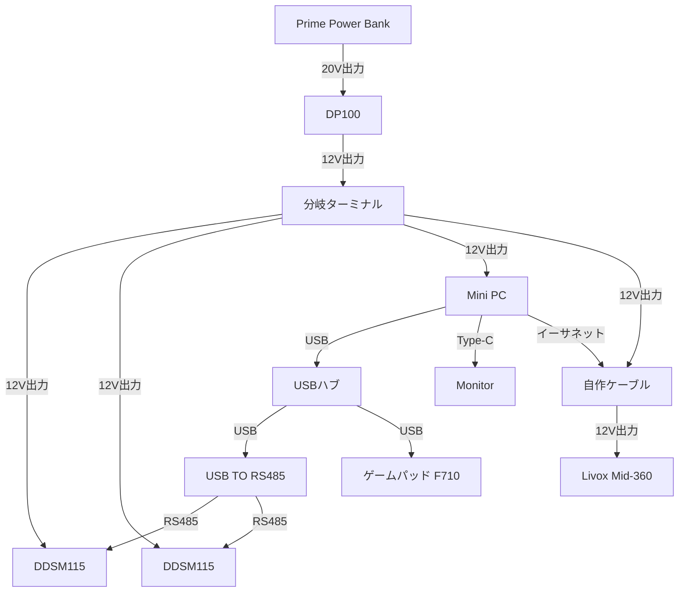

# susumu_robo
## 方向性
- ROS2搭載で静かに動く移動ロボット
- なるべく市販品を使う、扱いやすく安全な電源を使う
## TODO
- [x] 機器を接続する
- [x] 起動後にすぐに動かせるようにする
- [ ] 3Dプリンターでカバーを作る
- [ ] LiDARを使って障害物を検知し、停止する

## ハードウェア
### 機器
| Item                                                                                                                                                                                                                                                   | 数量 | 重量                                                   | 補足・備考                                                                                                                      |
|--------------------------------------------------------------------------------------------------------------------------------------------------------------------------------------------------------------------------------------------------------|----|------------------------------------------------------|---------------------------------------------------------------------------------------------------------------------------------|
| [Prime Power Bank (27650mAh, 250W)](https://www.ankerjapan.com/products/a1340)                                                                                                                                                                         | 1  | [約665g](https://www.ankerjapan.com/products/a1340)   | USB-C1 / C2 出力：5V⎓3A / 9V⎓3A / 12V⎓1.5A / 15V⎓3A / 20V⎓5A / 28V⎓5A (最大140W)                                                                 |
| [DP100 安定化電源](https://www.switch-science.com/products/9414)                                                                                                                                                                                            | 1  | [約95g](https://www.switch-science.com/products/9414) | 入出力電源スペック: 入力 100-240V AC, 出力 0-30V DC / 0-5A                                                                      |
| [DDSM115 ダイレクトドライブサーボモーター](https://www.switch-science.com/products/9628)                                                                                                                                                                               | 2  | 約765g                                                |                                                                                        |
| [8HP-CAPLCD Monitor](https://www.waveshare.com/8hp-caplcd-monitor.htm)                                                                                                                                                                                 | 1  | 623g                                                 | 8インチ静電容量式タッチディスプレイ、1280×800、HDMI/Type-Cディスプレイインターフェース SKU:24483 |
| [プラス・マイナス分岐ターミナル](https://www.amon.jp/products2/detail.php?product_code=3360)                                                                                                                                                                          | 1  | -                                                    | DC12V車専用、使用可能電流:5A、使用可能電力:60W以下、適合コードサイズ:0.12〜1.25sq相当(AWG26〜16)                                      |
| [Waveshare USB TO RS485](https://www.waveshare.com/usb-to-rs485.htm)                                                                                                                                                                                   | 1  | -                                                    | USB to RS485インターフェースコンバーター                                                                                         |
| [Livox Mid-360](https://www.livoxtech.com/jp/mid-360)                                                                                                                                                                                                  | 1  | [約265g](https://www.livoxtech.com/jp/mid-360)        | LiDARモジュール、360度スキャン対応                                                                                            |
| [TRIGKEY G5 Mini PC](https://trigkey.com/products/trigkey-g5-mini-pc-w11-desktop-12th-gen-intel-n1004core-up-to-3-4ghz-16g-ddr4-500g-pcie1-ssd-dual-ethernet-mini-computer-support-micro-computer-w10-pro-wifi-6-bt5-2-dual-hdmi-triple-screen-output) | 1  | 約800g                                                ||
| [Logicool ゲームパッド F710](https://www.logicool.co.jp/ja-jp/products/gamepads/f710-wireless-gamepad.940-000144.html) | 1 | - | 無線ゲームパッド |
| [自作ケーブル](https://www.sato-susumu.com/entry/mid360_cable)| 1 | - |Livox Mid-360とPCを接続するためのケーブル|
| USBハブ | 1 | - |  |

### フレーム部分
| Item                                                                                                     | 数量 | 重量         | 合計重量     | 備考・補足                                                    |
|----------------------------------------------------------------------------------------------------------|------|------------|----------|----------------------------------------------------------|
| [HSMC50-R](https://jp.misumi-ec.com/vona2/detail/110300477340/?ProductCode=HSMC50-R)                    | 2    | 462g/1個    | 924g     | アルミフレーム用キャスタ、コーナー取付タイプ、軽荷重用                              |
| [HFSF5-2020-210](https://jp.misumi-ec.com/vona2/detail/110302683920/?ProductCode=HFSF5-2020-210)        | 4    | 約0.111kg/本 | 約0.444kg | アルミフレーム 5シリーズ、正方形、20×20mm、1列溝、3面溝、長さ: 210mm、重量: 0.53kg/m |
| [HFSF5-2020-230](https://jp.misumi-ec.com/vona2/detail/110302683920/?ProductCode=HFSF5-2020-230)        | 4    | 約0.122kg/本 | 約0.488kg | アルミフレーム 5シリーズ、正方形、20×20mm、1列溝、3面溝、長さ: 230mm、重量: 0.53kg/m |
| [HFSR5-2020-184](https://jp.misumi-ec.com/vona2/detail/110302685570/?ProductCode=HFSR5-2020-184)        | 4    | 約0.077kg/本 | 約0.309kg | アルミフレーム 5シリーズ、R形状、20×20mm、長さ: 184mm、重量: 0.42kg/m         |

## 配線図

