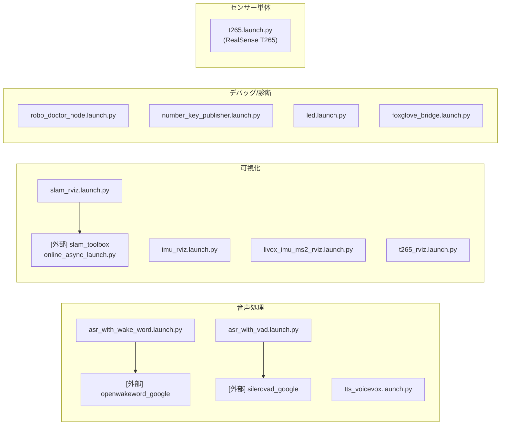
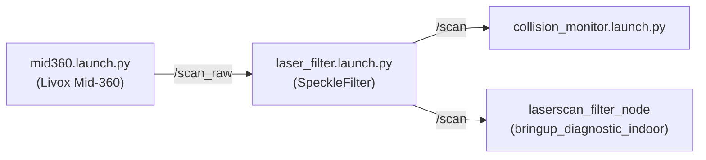

# Launch ファイル相関図

## 概要

各launchファイルの依存関係を示す。実線矢印は `IncludeLaunchDescription` による直接includeを表す。

---

## メインエントリポイント

```mermaid
graph TD
    %% ========== エントリポイント ==========
    robo_indoor["robo_indoor.launch.py\n(屋内メイン起動)"]
    robo["robo.launch.py\n(屋外/GNSS環境)"]
    bringup["bringup.launch.py\n(基本システム)"]
    nav2["nav2.launch.py\n(自律ナビゲーション)"]

    %% ========== robo_indoor の依存 ==========
    mid360["mid360.launch.py\n(Livox LiDAR)"]
    laser_filter["laser_filter.launch.py\n(スペックルフィルタ)"]
    bringup_diag_in["bringup_diagnostic_indoor.launch.py"]
    collision["collision_monitor.launch.py\n(障害物回避)"]
    twist_mux["twist_mux.launch.py\n(Twist多重化)"]
    foxglove_bridge_ext["[外部] foxglove_bridge\n(可視化 port:8765)"]
    botwheel["botwheel_teleop.launch.py\n(モーター制御)"]
    d435i["d435i.launch.py\n(RealSense D435i)"]
    key_event_sys["key_event_system.launch.py"]

    robo_indoor --> mid360
    robo_indoor --> laser_filter
    robo_indoor --> bringup_diag_in
    robo_indoor --> collision
    robo_indoor --> twist_mux
    robo_indoor --> foxglove_bridge_ext
    robo_indoor --> botwheel
    robo_indoor --> d435i
    robo_indoor --> key_event_sys

    %% ========== bringup の依存 ==========
    base["base.launch.py\n(twist_stamper)"]

    bringup --> base
    bringup --> collision
    bringup --> foxglove_bridge_ext

    %% ========== robo (屋外) の依存 ==========
    gnss["gnss.launch.py\n(Septentrio GNSS)"]
    imu_wt901["imu_wt901.launch.py\n(WT901 IMU)"]
    dummy_navsatfix["dummy_navsatfix.launch.py"]
    ecef_to_enu["ecef_to_enu.launch.py"]
    ntrip["ntrip_str2str.launch.py\n(GNSS補正)"]

    robo --> mid360
    robo --> gnss
    robo --> imu_wt901
    robo --> dummy_navsatfix
    robo --> ecef_to_enu
    robo --> ntrip
    robo --> key_event_sys

    %% ========== nav2 の依存 ==========
    nav2_bringup_ext["[外部] nav2_bringup\nbringup_launch.py"]
    nav2_rviz_ext["[外部] nav2_bringup\nrviz_launch.py"]

    nav2 --> nav2_bringup_ext
    nav2 --> nav2_rviz_ext

    %% ========== key_event_system の依存 ==========
    tenkey["tenkey_publisher.launch.py\n(テンキー入力)"]
    key_handler["key_event_handler.launch.py\n(キーイベント処理)"]

    key_event_sys --> tenkey
    key_event_sys --> key_handler

    %% ========== bringup_diagnostic の依存 ==========
    sensors_mon_ext["[外部] sensors_monitor\n(診断システム)"]
    bringup_diag_in --> sensors_mon_ext

    %% ========== botwheel の依存 ==========
    botwheel_ext["[外部] botwheel_explorer\n(ODriveドライバ)"]
    botwheel --> botwheel_ext

    %% ========== mid360 のトピック ==========
    mid360 -->|"/scan_raw"| laser_filter
    laser_filter -->|"/scan"| collision

    %% ========== スタイル ==========
    classDef entry fill:#4a90d9,stroke:#2c5f8a,color:#fff
    classDef external fill:#aaa,stroke:#777,color:#fff
    classDef composite fill:#f0a500,stroke:#b07800,color:#fff

    class robo_indoor,robo,bringup,nav2 entry
    class foxglove_bridge_ext,nav2_bringup_ext,nav2_rviz_ext,sensors_mon_ext,botwheel_ext entry
    class key_event_sys,bringup_diag_in composite
```

---

## 単独起動ファイル一覧

以下は `robo_indoor` / `robo` / `bringup` に含まれず、単体でGUIメニューから起動するもの。

---

## トピックフロー（スキャンデータ）

