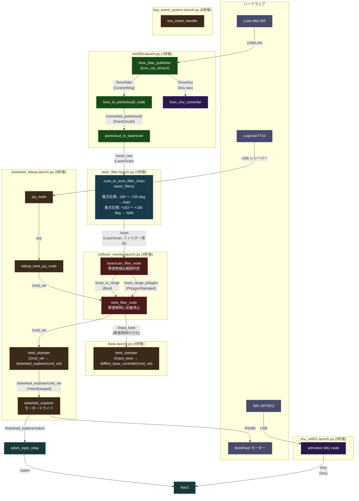

# ノード・トピック関係図（robo_indoor 構成）

`robo_indoor.launch.py` で起動される全ノードとトピックの接続関係。

## 全体フロー

## トピック一覧

| トピック | 型 | Publisher | Subscriber | 備考 |
|---------|-----|-----------|------------|------|
| `/livox/lidar` | `CustomMsg` | livox_lidar_publisher | livox_to_pointcloud2_node | Livox独自形式 |
| `/converted_pointcloud2` | `PointCloud2` | livox_to_pointcloud2_node | pointcloud_to_laserscan | |
| `/scan_raw` | `LaserScan` | pointcloud_to_laserscan | scan_to_scan_filter_chain | フィルター前の生データ |
| `/scan` | `LaserScan` | scan_to_scan_filter_chain | laserscan_filter_node, amcl, costmap 等 | **フィルター済み** |
| `/scan_in_range` | `Bool` | laserscan_filter_node | twist_filter_node | 障害物検出フラグ |
| `/scan_range_polygon` | `PolygonStamped` | laserscan_filter_node | — | 検出範囲の可視化用 |
| `/joy` | `Joy` | joy_node | teleop_twist_joy_node | |
| `/cmd_vel` | `Twist` | teleop_twist_joy_node, twist_filter_node 他 | twist_stamper (ts2), twist_filter_node | |
| `/input_twist` | `Twist` | twist_filter_node, laserscan_filter_node | twist_stamper (ts1) | 障害物時ゼロ化済み |
| `/diffbot_base_controller/cmd_vel` | `TwistStamped` | twist_stamper (ts1) | — | 現在 subscriber なし |
| `/botwheel_explorer/cmd_vel` | `TwistStamped` | twist_stamper (ts2), teleop_twist_joy_node | botwheel_explorer | |
| `/botwheel_explorer/odom` | `Odometry` | botwheel_explorer | odom_topic_relay | |
| `/odom` | `Odometry` | odom_topic_relay | controller_server, bt_navigator | |
| `/imu` | `Imu` | witmotion | Nav2 | |
| `/livox/imu` | `Imu` | livox_lidar_publisher | livox_imu_converter | G単位 |
| `/livox/imu_ms2` | `Imu` | livox_imu_converter | — | m/s²変換済み（outdoor用） |

## laser_filter の設定

`config/laser_filter.yaml` で定義。

| フィルター | パラメータ | 値 | 意味 |
|-----------|-----------|-----|------|
| filter1（後方右） | `lower_angle` / `upper_angle` | -3.1416 / -2.3562 rad（-180° 〜 -135°） | 後方右側ボディノイズをNaN置換 |
| filter2（後方左） | `lower_angle` / `upper_angle` | 2.8448 / 3.1416 rad（+163° 〜 +180°） | 後方左側ボディノイズをNaN置換 |
| filter3（スペックル） | `filter_type` / `max_range_difference` / `filter_window` | 1 / 0.3 / 2 | 散発的な外れ値を除去 |

ロボット後方両側に出るボディ由来の近接ノイズ（0.1〜0.2m）を除去する。

## 起動タイミング

```mermaid
gantt
    title robo_indoor.launch.py 起動シーケンス
    dateFormat s
    axisFormat %Ss

    mid360              : 1, 2s
    laser_filter        : 2, 3s
    bringup_diagnostic  : 2, 3s
    base                : 4, 5s
    collision_monitor   : 4, 5s
    foxglove_bridge     : 4, 5s
    imu_wt901           : 5, 6s
    botwheel_teleop     : 6, 7s
    key_event_system    : 6, 7s
```

