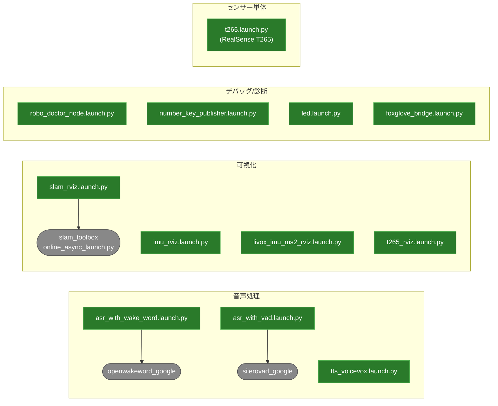
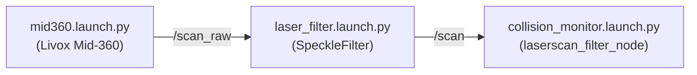
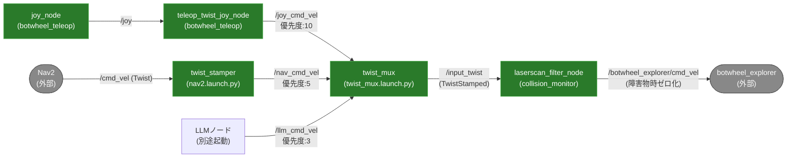
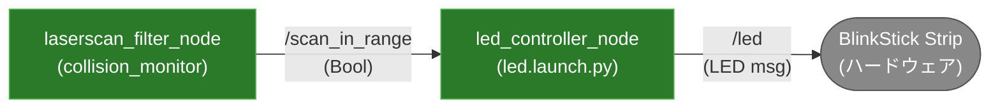
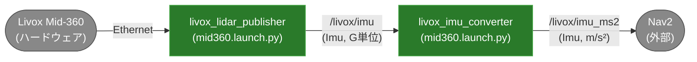

# Launch ファイル一覧

## 目次

- [アクティブ](#アクティブ)
- [非アクティブ](#非アクティブ)
- [Launch ファイル相関図](#launch-ファイル相関図)
  - [メインエントリポイント](#メインエントリポイント)
  - [単独起動ファイル](#単独起動ファイル)
  - [トピックフロー（LiDARパイプライン）](#トピックフローlidarパイプライン)
  - [トピックフロー（スキャンデータ）](#トピックフロースキャンデータ)
  - [トピックフロー（cmd_vel）](#トピックフローcmd_vel)
  - [トピックフロー（障害物検知→LED）](#トピックフロー障害物検知led)
  - [トピックフロー（IMU）](#トピックフローimu)

---

## アクティブ

`robo_indoor.launch.py` または `nav2.launch.py` から直接・間接に使用されているもの。

| ファイル | 機能 |
|---|---|
| `robo_indoor.launch.py` | 屋内メイン起動 |
| `nav2.launch.py` | 自律ナビゲーション |
| `mid360.launch.py` | Livox Mid-360 LiDAR |
| `d435i.launch.py` | RealSense D435i 深度カメラ |
| `laser_filter.launch.py` | LiDARスペックルフィルタ |
| `collision_monitor.launch.py` | 障害物回避 |
| `twist_mux.launch.py` | Twist優先度多重化 |
| `botwheel_teleop.launch.py` | ゲームパッド＋モーター制御 |
| `key_event_system.launch.py` | キーイベント統合起動 |
| `key_event_handler.launch.py` | キーイベント処理 |
| `tenkey_publisher.launch.py` | テンキー入力 |
| `bringup_diagnostic_indoor.launch.py` | 屋内診断システム |
| `slam_rviz.launch.py` | SLAM + RViz可視化 |

## 非アクティブ

| ファイル | 機能 |
|---|---|
| `outdoor_option.launch.py` | 屋外GNSS関連起動 |
| `gnss.launch.py` | Septentrio GNSS |
| `imu_wt901.launch.py` | WT901 IMU |
| `ntrip_str2str.launch.py` | GNSS補正データ配信 |
| `ecef_to_enu.launch.py` | 座標系変換 (ECEF→ENU) |
| `dummy_navsatfix.launch.py` | NavSatFixダミー配信 |
| `t265.launch.py` | RealSense T265 |
| `tts_voicevox.launch.py` | VoiceVox 音声合成 |
| `asr_with_wake_word.launch.py` | ウェイクワード付き音声認識 |
| `asr_with_vad.launch.py` | VAD付き音声認識 |
| `number_key_publisher.launch.py` | 数字キー入力 |
| `led.launch.py` | BlinkStick LED制御 |
| `foxglove_bridge.launch.py` | Foxglove可視化ブリッジ |
| `imu_rviz.launch.py` | IMU RViz可視化 |
| `livox_imu_ms2_rviz.launch.py` | Livox IMU RViz可視化 |
| `t265_rviz.launch.py` | T265 RViz可視化 |
| `robo_doctor_node.launch.py` | システム診断 |
| `bringup_diagnostic_outdoor.launch.py` | 屋外診断システム |

---

## Launch ファイル相関図

### メインエントリポイント

凡例: 青=エントリポイント / 緑=内部launchファイル / 灰(丸角)=外部パッケージ

```mermaid
graph TD
    %% ========== エントリポイント ==========
    robo_indoor["robo_indoor.launch.py\n(屋内メイン起動)"]
    robo["outdoor_option.launch.py\n(屋外/GNSS環境)"]
    nav2["nav2.launch.py\n(自律ナビゲーション)"]

    %% ========== robo_indoor の依存 ==========
    mid360["mid360.launch.py\n(Livox LiDAR)"]
    laser_filter["laser_filter.launch.py\n(スペックルフィルタ)"]
    bringup_diag_in["bringup_diagnostic_indoor.launch.py"]
    collision["collision_monitor.launch.py\n(障害物回避)"]
    twist_mux["twist_mux.launch.py\n(Twist多重化)"]
    foxglove_bridge_ext(["foxglove_bridge\n(可視化 port:8765)"])
    botwheel["botwheel_teleop.launch.py\n(モーター制御)"]
    d435i["d435i.launch.py\n(RealSense D435i)"]
    key_event_sys["key_event_system.launch.py"]

    robo_indoor --> mid360
    robo_indoor --> laser_filter
    robo_indoor --> bringup_diag_in
    robo_indoor --> collision
    robo_indoor --> twist_mux
    robo_indoor --> foxglove_bridge_ext
    robo_indoor --> botwheel
    robo_indoor --> d435i
    robo_indoor --> key_event_sys

    %% ========== outdoor_option の依存 ==========
    gnss["gnss.launch.py\n(Septentrio GNSS)"]
    dummy_navsatfix["dummy_navsatfix.launch.py"]
    ecef_to_enu["ecef_to_enu.launch.py"]
    ntrip["ntrip_str2str.launch.py\n(GNSS補正)"]

    robo --> gnss
    robo --> dummy_navsatfix
    robo --> ecef_to_enu
    robo --> ntrip

    %% ========== nav2 の依存 ==========
    nav2_bringup_ext(["nav2_bringup\nbringup_launch.py"])
    nav2_rviz_ext(["nav2_bringup\nrviz_launch.py"])

    nav2 --> nav2_bringup_ext
    nav2 --> nav2_rviz_ext

    %% ========== key_event_system の依存 ==========
    tenkey["tenkey_publisher.launch.py\n(テンキー入力)"]
    key_handler["key_event_handler.launch.py\n(キーイベント処理)"]

    key_event_sys --> tenkey
    key_event_sys --> key_handler

    %% ========== bringup_diagnostic の依存 ==========
    sensors_mon_ext(["sensors_monitor\n(診断システム)"])
    bringup_diag_in --> sensors_mon_ext

    %% ========== botwheel の依存 ==========
    botwheel_ext(["botwheel_explorer\n(ODriveドライバ)"])
    botwheel --> botwheel_ext

    %% ========== mid360 のトピック ==========
    mid360 -->|"/scan_raw"| laser_filter
    laser_filter -->|"/scan"| collision

    %% ========== スタイル ==========
    classDef entry fill:#4a90d9,stroke:#2c5f8a,color:#fff
    classDef internal fill:#2a7a2a,stroke:#50b050,color:#fff
    classDef external fill:#888,stroke:#555,color:#fff
    classDef composite fill:#f0a500,stroke:#b07800,color:#fff

    class robo_indoor,robo,nav2 entry
    class mid360,laser_filter,collision,twist_mux,botwheel,d435i,base,gnss,dummy_navsatfix,ecef_to_enu,ntrip,tenkey,key_handler internal
    class foxglove_bridge_ext,nav2_bringup_ext,nav2_rviz_ext,sensors_mon_ext,botwheel_ext external
    class key_event_sys,bringup_diag_in composite
```

### 単独起動ファイル

凡例: 緑=内部launchファイル / 灰(丸角)=外部パッケージ

### トピックフロー（LiDARパイプライン）

Livox Mid-360からLaserScanになるまでの変換フロー。

```mermaid
graph LR
    hw(["Livox Mid-360\n(ハードウェア)"])
    driver["livox_lidar_publisher\n(mid360.launch.py)"]
    conv["livox_to_pointcloud2_node\n(mid360.launch.py)"]
    pc2scan["pointcloud_to_laserscan\n(mid360.launch.py)"]
    lf["laser_filter\n(laser_filter.launch.py)"]

    hw -->|"Ethernet"| driver
    driver -->|"/livox/lidar\n(CustomMsg)"| conv
    conv -->|"/converted_pointcloud2\n(PointCloud2)"| pc2scan
    pc2scan -->|"/scan_raw\n(LaserScan)"| lf
    lf -->|"/scan\n(LaserScan, フィルタ済み)"| ...

    classDef internal fill:#2a7a2a,stroke:#50b050,color:#fff
    classDef external fill:#888,stroke:#555,color:#fff
    class driver,conv,pc2scan,lf internal
    class hw external
```

### トピックフロー（スキャンデータ）

### トピックフロー（cmd_vel）

### トピックフロー（障害物検知→LED）

障害物検知の結果がLED制御に伝わるフロー。

### トピックフロー（IMU）

Livox IMUの単位変換フロー。

