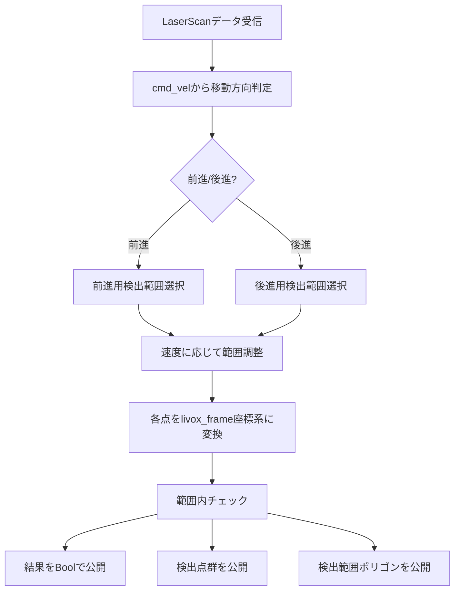
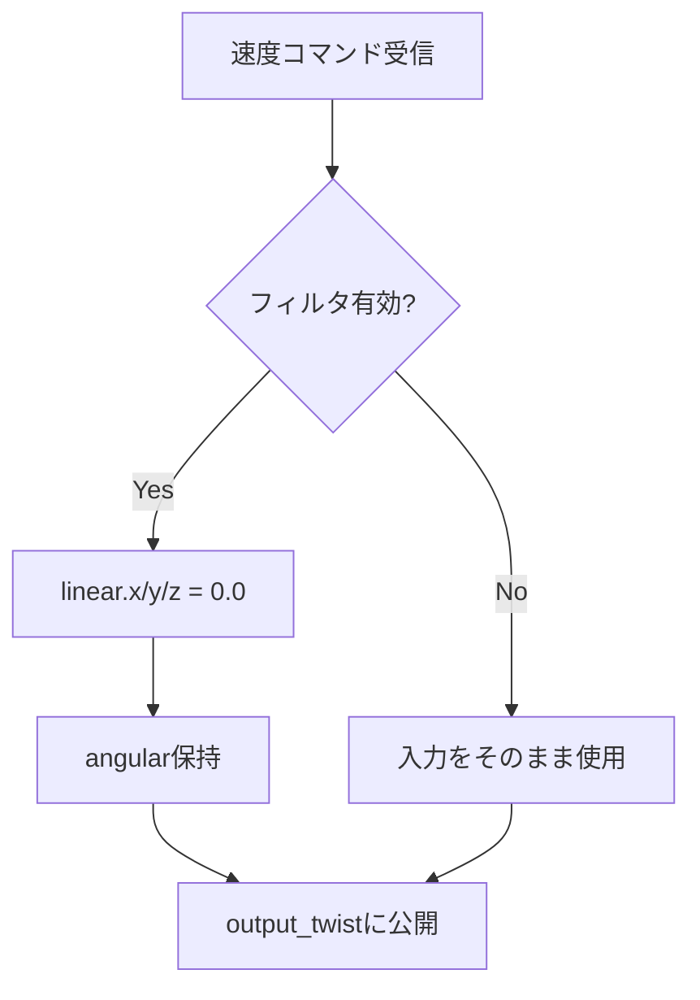
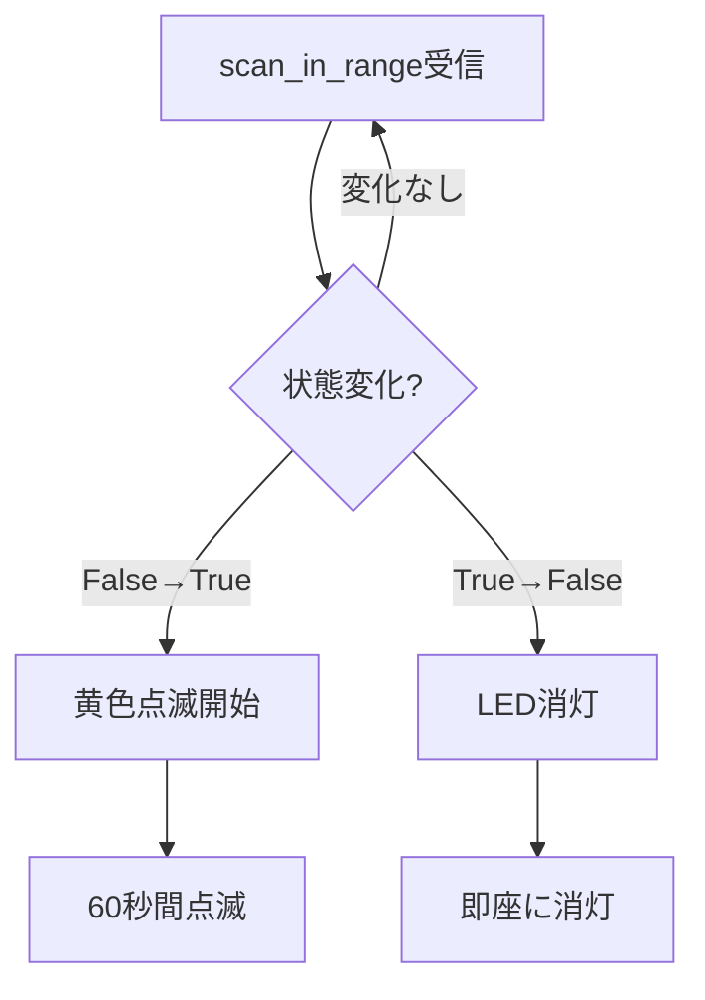
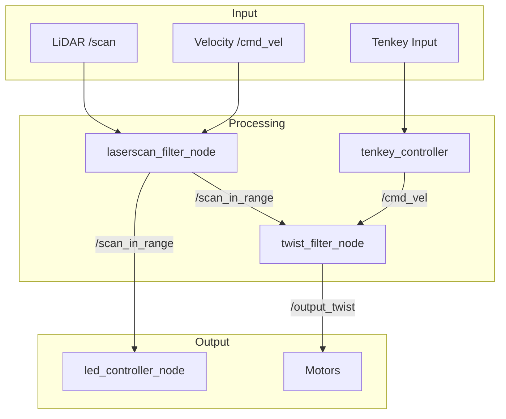

# Susumu Robo スクリプトドキュメント

このドキュメントは、`susumu_robo`パッケージ内の各Pythonスクリプトの詳細な説明を提供します。

## 目次

1. [laserscan_filter_node.py](#laserscan_filter_nodepy) - LiDARデータのフィルタリング
2. [twist_filter_node.py](#twist_filter_nodepy) - 速度コマンドの安全フィルタ
3. [led_controller_node.py](#led_controller_nodepy) - LED制御
4. [tenkey_controller.py](#tenkey_controllerpy) - テンキー入力制御
5. [laser_scan_detect_test.py](#laser_scan_detect_testpy) - 物体検出テスト
6. [laser_scan_test.py](#laser_scan_testpy) - LaserScan表示テスト

---

## laserscan_filter_node.py

### 概要
LiDARからのスキャンデータをフィルタリングし、ロボットの周囲の指定領域内に障害物があるかを検出するノードです。前進・後進の移動方向に応じて検出領域を動的に切り替えます。

### 機能
- LiDARデータの座標変換（laser_frame → livox_frame）
- 前進/後進に応じた検出範囲の切り替え
- 検出範囲の速度に応じた動的調整
- 検出結果の可視化用データ生成

### ROS2インターフェース

#### 購読トピック
| トピック名 | 型 | 説明 |
|-----------|-----|------|
| `/scan` | `sensor_msgs/LaserScan` | LiDARからのスキャンデータ |
| `/cmd_vel` | `geometry_msgs/Twist` | 速度コマンド（移動方向判定用） |

#### 公開トピック
| トピック名 | 型 | 説明 |
|-----------|-----|------|
| `/scan_in_range` | `std_msgs/Bool` | 指定範囲内に障害物があるかのフラグ |
| `/detected_points` | `sensor_msgs/LaserScan` | 検出された点群のみを含むLaserScan |
| `/scan_range_polygon` | `geometry_msgs/PolygonStamped` | 検出範囲の可視化用ポリゴン |

### パラメータ

```yaml
reference_link: 'livox_frame'  # 座標変換の基準フレーム

forward:  # 前進時の検出範囲
  x_min: -0.22
  x_max: 0.22
  y_min: -0.22
  y_max: 0.22

backward:  # 後進時の検出範囲
  x_min: -0.22
  x_max: 0.22
  y_min: -0.22
  y_max: 0.22
```

### 処理フロー



### 使用例
```bash
ros2 run susumu_robo laserscan_filter_node
```

---

## twist_filter_node.py

### 概要
障害物が検出された際に、ロボットの直進移動（前進・後進）を停止させる安全フィルタです。回転動作は許可されるため、その場での方向転換は可能です。

### 機能
- 障害物検出時の自動停止
- 回転動作の維持
- フィルタリングの有効/無効切り替え

### ROS2インターフェース

#### 購読トピック
| トピック名 | 型 | 説明 |
|-----------|-----|------|
| `/input_twist` | `geometry_msgs/Twist` | フィルタリング前の速度コマンド |
| `/enable` | `std_msgs/Bool` | フィルタリングの有効/無効フラグ |

#### 公開トピック
| トピック名 | 型 | 説明 |
|-----------|-----|------|
| `/output_twist` | `geometry_msgs/Twist` | フィルタリング後の速度コマンド |

### 処理フロー



### 動作詳細
- `enable = True`: 直進成分（linear）を0に設定、回転成分（angular）は維持
- `enable = False`: 入力をそのまま出力

### 使用例
```bash
ros2 run susumu_robo twist_filter_node
```

---

## led_controller_node.py

### 概要
障害物の検出状態に応じてLEDの点灯パターンを制御します。障害物検出時は黄色で点滅、非検出時は消灯します。

### 機能
- 障害物検出状態の監視
- LED点滅パターンの制御
- 状態変化時の即座な反応

### ROS2インターフェース

#### 購読トピック
| トピック名 | 型 | 説明 |
|-----------|-----|------|
| `/scan_in_range` | `std_msgs/Bool` | 障害物検出フラグ |

#### 公開トピック
| トピック名 | 型 | 説明 |
|-----------|-----|------|
| `/led` | `susumu_ros2_interfaces/LED` | LED制御コマンド |

### LED制御パターン

| 状態 | 動作 | 色 | 点滅速度 | 継続時間 | 優先度 |
|------|------|-----|----------|----------|--------|
| 障害物検出 | 点滅 | 黄色 | 3.0 | 60秒 | 通常 |
| 障害物なし | 消灯 | - | - | - | 99999（最高） |

### 処理フロー



### 使用例
```bash
ros2 run susumu_robo led_controller_node
```

---

## tenkey_controller.py

### 概要
USBテンキーパッドを使用してロボットを手動操作するためのコントローラです。矢印キーで前後左右の移動、5キーで停止が可能です。

### 機能
- USBテンキーからの入力読み取り
- キー入力に応じた速度コマンド生成
- 同時押し防止（最新のキー入力のみ有効）

### ROS2インターフェース

#### 公開トピック
| トピック名 | 型 | 説明 |
|-----------|-----|------|
| `/turtle1/cmd_vel` | `geometry_msgs/Twist` | 速度コマンド |

### パラメータ

```yaml
keyboard_device_path: '/dev/input/by-id/usb-05a4_Tenkey_Keyboard-event-kbd'
cmd_vel_topic: '/turtle1/cmd_vel'
linear_speed: 1.0  # 直進速度 [m/s]
angular_speed: 1.0  # 回転速度 [rad/s]
```

### キーマッピング

| キー | 動作 | linear.x | angular.z |
|------|------|----------|-----------|
| 8 (↑) | 前進 | +1.0 | 0.0 |
| 2 (↓) | 後進 | -1.0 | 0.0 |
| 4 (←) | 左回転 | 0.0 | +1.0 |
| 6 (→) | 右回転 | 0.0 | -1.0 |
| 5 | 停止 | 0.0 | 0.0 |

### 必要な権限
```bash
# ユーザーをinputグループに追加
sudo usermod -a -G input $USER
# 再ログインが必要
```

### 使用例
```bash
ros2 run susumu_robo tenkey_controller
```

---

## laser_scan_detect_test.py

### 概要
LaserScanデータから前方、後方、近距離の物体を検出し、結果をログに出力するテストツールです。

### 機能
- 前方物体検出（±90度、0.5m以内）
- 後方物体検出（±90度より外側、0.5m以内）
- 近距離物体検出（全方向、0.3m以内）

### ROS2インターフェース

#### 購読トピック
| トピック名 | 型 | 説明 |
|-----------|-----|------|
| `/scan` | `sensor_msgs/LaserScan` | LiDARデータ |

### 検出条件

| 検出タイプ | 距離条件 | 角度条件 |
|-----------|---------|---------|
| 前方物体 | < 0.5m | -90° ≤ θ ≤ 90° |
| 後方物体 | < 0.5m | θ < -90° または θ > 90° |
| 近距離物体 | < 0.3m | 全方向 |

### 出力形式
```
前方に物体を検出: [(距離1, 角度1), (距離2, 角度2), ...]
後方に物体を検出: [(距離1, 角度1), (距離2, 角度2), ...]
近距離に物体を検出: [(距離1, 角度1), (距離2, 角度2), ...]
```

### 使用例
```bash
ros2 run susumu_robo laser_scan_detect_test
```

---

## laser_scan_test.py

### 概要
LaserScanデータの一部を段階的に表示するテストツールです。表示範囲を10%ずつ増減させることで、LiDARデータの動作確認ができます。

### 機能
- LaserScanデータの部分表示
- 表示範囲の自動循環（0% → 100% → 0%）
- 非表示部分は無限大として処理

### ROS2インターフェース

#### 購読トピック
| トピック名 | 型 | 説明 |
|-----------|-----|------|
| `/scan` | `sensor_msgs/LaserScan` | 元のLiDARデータ |

#### 公開トピック
| トピック名 | 型 | 説明 |
|-----------|-----|------|
| `/modified_scan` | `sensor_msgs/LaserScan` | 加工されたLiDARデータ |

### 動作パターン

```
時刻 0s: 0%表示（全データ無限大）
時刻 1s: 10%表示（最初の10%のみ有効）
時刻 2s: 20%表示
...
時刻 10s: 100%表示（全データ有効）
時刻 11s: 0%表示（サイクル再開）
```

### 使用例
```bash
ros2 run susumu_robo laser_scan_test

# 別ターミナルで確認
ros2 topic echo /modified_scan
```

---

## システム連携図



## トラブルシューティング

### laserscan_filter_node
- **問題**: TFエラーが発生する
  - **解決**: `ros2 run tf2_tools view_frames`でTFツリーを確認
  - livox_frameとlaser_link間の変換が存在することを確認

### twist_filter_node
- **問題**: 速度コマンドが通らない
  - **解決**: `/enable`トピックの値を確認（`ros2 topic echo /enable`）

### led_controller_node
- **問題**: LEDが点灯しない
  - **解決**: BlinkStickの接続とUSB権限を確認

### tenkey_controller
- **問題**: デバイスが見つからない
  - **解決**: `ls /dev/input/by-id/`でデバイスパスを確認
  - パラメータで正しいパスを設定

## 関連ファイル

- **設定ファイル**: `config/`ディレクトリ内のYAMLファイル
- **起動ファイル**: `launch/`ディレクトリ内の各launch.pyファイル
- **サービスファイル**: `launch/`ディレクトリ内のsystemdサービス関連ファイル